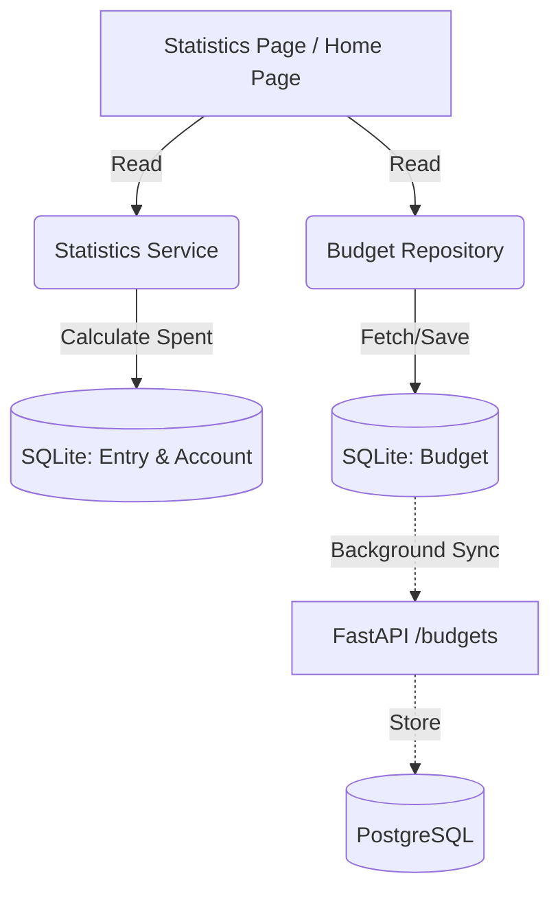

# 導入預算管理系統計畫

## 1. 適合度評估 (Feasibility & Suitability)

**判斷結果：非常適合**。

- **會計邏輯穩固 (Accountant View)**：目前的架構（`AppDatabase` 搭配複式簿記的 `Account` 及 `Entry`）非常清晰。由於所有的支出都會透過 `credit_account_id` 或 `debit_account_id` 掛載在 `AccountType.expense` 之下，計算當月總支出或特定分類支出只需簡單的聚合查詢（Aggregation），數學模型非常準確。
- **使用者價值 (Product Designer View)**：對記帳 App 而言，除了「記錄過去」，更重要的是「控制未來」。預算功能提供了財務的「安全護欄」，解決了使用者「不知道錢花去哪、能不能再花」的痛點。
- **漸進式體驗 (Progressive Disclosure)**：支援「總預算」與「分類預算」，可以讓剛入門的使用者先設定單一總目標，而熟悉後再針對「飲食」、「娛樂」等高頻開銷設立個別上限。

---

## 2. 系統設計 (System Design)

### 2.1 資料模型 (Data Model)

在 SQLite 與 PostgreSQL 中新增 `Budget` (預算) 實體：

- `id` (String): 主鍵 UUID。
- `amount` (Double/Real): 預算設定金額。
- `period_type` (String): 固定為 `monthly` (每月 1 號至月底)。
- `account_sub_type` (String, nullable): 關聯的支出分類（對應 `Account.subType`，如 `飲食`）。若為 `null`，則代表此為「整體總預算」。
- `created_at`, `updated_at`, `deleted_at`, `synced`: 用於與伺服器進行離線同步。

### 2.2 使用者介面與體驗 (UI/UX)

- **導覽與入口設計 (Navigation & Entry Points)**
  - **不新增獨立 Tab**：為避免 Bottom Navigation 擁擠與增加認知負擔，預算管理不獨立設為一個主頁 Tab。
  - **高頻觀看（即時回饋）**：將「預算進度卡片」整合於 **「統計 (Statistics)」** 或 **「明細 (Journal)」** 頁的頂部，確保使用者在查看財務狀況時能第一眼看見剩餘可用預算。
  - **低頻操作（漸進式揭露）**：「預算設定與修改」收納於 **「個人 (Profile)」** 頁內的二級選單，同時也支援直接點擊「預算進度卡片」進入設定頁面。
- **首頁/統計頁的預算進度卡片 (Budget Progress Card)**
  - **視覺回饋 (Feedback)**：以進度條（Progress Bar）顯示。當花費 < 80% 顯示安全色（綠/主色）；80% ~ 100% 顯示警戒色（黃/橘）；> 100% 顯示超支色（紅）。
  - **關鍵資訊**：顯示「剩餘可用預算」、「本月剩餘天數」以及「每日建議可用餘額」，降低使用者的認知負擔 (Cognitive Load)。
- **分類預算明細**
  - 以清單方式列出有設定預算的分類，並提供個別的微型進度條。
- **設定與容錯流程 (Forgiveness & Setup)**
  - 提供預設快速選項（例如根據過去三個月平均花費推薦預算數字）。
  - 允許隨時修改預算金額，並立即反映在進度條上。

---

## 3. 實作架構 (Implementation Architecture)

### Mobile App (Flutter)

1. **Schema (`mobile/lib/features/budget/data/schema/budget.dart`)**：定義 SQLite table。
2. **Database (`mobile/lib/core/database/app_database.dart`)**：將 `budget` 註冊進 `_onCreate`，並在 `_onUpgrade` 中處理遷移 (Version Bump)。
3. **Repository (`mobile/lib/features/budget/data/repositories/budget.dart`)**：實作 CRUD，以及獲取當前設定。
4. **Service / Usecase**：結合 `BudgetRepository` 與現有的 `StatisticsService` (`mobile/lib/features/statistics/data/services/statistics.dart`)，算出「預算」與「實際支出」的差額。

### API Server (Python/FastAPI)

1. **Model (`api-server/models/budget.py`)**：新增 SQLAlchemy 模型。
2. **Router (`api-server/routers/budgets.py`)**：實作對應的 RESTful 介面供 Mobile 同步。

