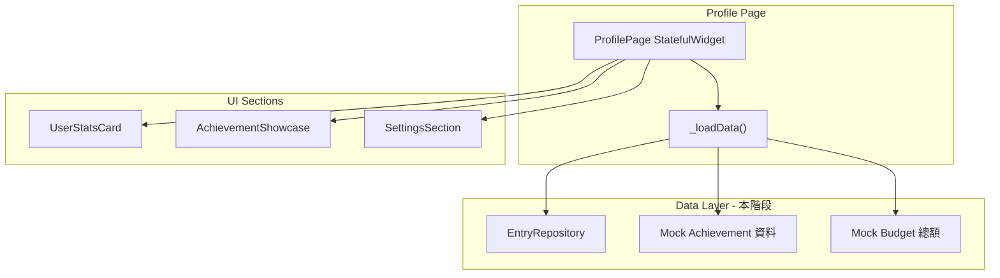

# 個人頁 (Profile Page) 實作計畫

## 現況摘要

- [profile_page.dart](mobile/lib/features/profile/presentation/pages/profile_page.dart) 目前為空 Scaffold + AppBar。
- 專案採用 **StatefulWidget + `Future<_Data> _loadData()`** 模式（見 [journal_page.dart](mobile/lib/features/entry/presentation/pages/journal_page.dart)、[account_page.dart](mobile/lib/features/account/presentation/pages/account_page.dart)），無 Riverpod/Provider。
- [EntryRepository](mobile/lib/features/entry/data/repositories/entry.dart) 有 `getAll()` / `getByDateRange()`，尚無 `getCount()`；Achievement / Budget 尚未有 feature 或 repository。
- 底部表單使用 [showAppBottomSheet](mobile/lib/shared/widgets/app_bottom_sheet.dart)；導覽為 `Navigator.push(MaterialPageRoute(...))`。
- Shell 目前未將 `refreshTrigger` 傳給 `ProfilePage`，其他 Tab 皆有傳。

---

## 架構與資料流

- **狀態來源**：單一 `Future<ProfilePageData> _loadData()` 聚合「儀表板數字、成就列表、預算摘要」；現階段 Achievement/Budget 用假資料，儀表板可選用 `EntryRepository.getAll().length` 或新增 `getCount()`。
- **ViewModel 取捨**：不引入額外狀態管理，沿用既有 **State + Future** 模式；若之後要接 Stream（例如 AchievementRepository.streamProgress），再在 Profile 層用 `StreamBuilder` 或抽出 ProfileViewModel 聚合多個 Stream。

---

## 1. 頁面骨架與載入

- **檔案**：[profile_page.dart](mobile/lib/features/profile/presentation/pages/profile_page.dart)
- 改為 `StatefulWidget`，接受 `ValueListenable<int>? refreshTrigger`（與 Journal/Statistics/Assets 一致）。
- **Shell**：`ProfilePage()` 改為 `ProfilePage(refreshTrigger: widget.refreshTrigger)`。
- `initState` 呼叫 `_future = _loadData()`，`refreshTrigger?.addListener` 時重設 `_future = _loadData()` 並 `setState`。
- Body 使用 **CustomScrollView**：
  - `SliverToBoxAdapter` 包「狀態卡片」；
  - `SliverToBoxAdapter` 包「成就展示區」；
  - `SliverFillRemaining` 或 `SliverList` 包「設定區」。
- **Loading**：`FutureBuilder<ProfilePageData>`，`ConnectionState.waiting` 時顯示**骨架屏**（例如整頁或三區塊用灰色圓角矩形佔位，高度與實際區塊接近），避免 layout shift。
- **Error**：`hasError` 時簡單錯誤訊息 + 重試按鈕。

---

## 2. 頂部狀態儀表板 (User Stats Card)

- **元件**：抽出為 `presentation/widgets/user_stats_card.dart`。
- **UI**：`Card`（圓角）內 `Padding` → `Row`，三個 **Expanded** 子項，每項：
  - 圖示 + 數字 + 短標（如 「連續活躍週」「總記帳數」「無消費日」）。
- **資料**：`ProfilePageData` 含 `weeklyStreak: int`、`totalEntries: int`、`noSpendDaysThisWeek: int`。
- **現階段資料來源**：
  - `totalEntries`：`EntryRepository.getAll()` 的 length，或於 [entry.dart](mobile/lib/features/entry/data/repositories/entry.dart) 新增 `static Future<int> getCount()`（`SELECT COUNT(*)` 較省記憶體）。
  - `weeklyStreak` / `noSpendDaysThisWeek`：先用**假資料**（例如 0 或固定值），之後由 Achievement 計畫的服務計算。

---

## 3. 成就展示區 (Achievement Showcase)

- **區塊標題**：左「我的成就」，右「查看全部」文字按鈕 → `Navigator.push` 至 **AchievementListPage**（新頁，目前空白 Scaffold 即可）。
- **水平列表**：`SizedBox(height: 120)` 內 `ListView.builder(scrollDirection: Axis.horizontal)`，item 為單一成就徽章。
- **徽章資料**：`ProfilePageData` 含 `List<AchievementItem>`；每項需：id、名稱、描述、取得條件文案、是否已解鎖、解鎖日（可選）、當前值、目標值（用於進度條）。
- **假資料**：至少包含「初來乍到（記錄第一筆）」及 1～2 個其他成就（如「百筆達成」「連續 3 週」），部分已解鎖、部分進行中。
- **單一徽章 UI**：
  - **已解鎖**：全彩、輕微陰影或發光，可顯示解鎖日。
  - **未解鎖**：灰階（`ColorFiltered(colorFilter: ColorFilter.mode(Colors.grey, BlendMode.saturation))` 或類似），下方小型進度條（如 60/100 筆）。
- **互動**：點擊任一徽章 → `showAppBottomSheet`（scrollable），標題為成就名稱，內容為說明 + 取得條件；已解鎖可顯示解鎖日。
- **空狀態 / 新手**：將「初來乍到」放在列表**第一項**；當 `totalEntries == 0` 時，該項加視覺強調（例如外框或標語）與 CTA：「立即記下第一筆帳！」。

---

## 4. 管理與設定區 (Settings & Management)

- **結構**：分組列表，與 [account_page](mobile/lib/features/account/presentation/pages/account_page.dart) 的 section 概念類似，用標題 + `ListTile` 群組。
- **分組**：
  - **財務管理**：預算設定（trailing 可顯示目前總預算，如 `$20,000`，假資料）、分類管理、標籤管理。
  - **系統設定**：外觀設定（深色/淺色/跟隨系統）、提醒與通知、資料備份與匯出。
  - **關於**：評價與回饋、版本資訊。
- **實作**：手刻 `Column` + 區塊標題（例如 `ListTile` 僅 title 或 `Padding` + `Text`）+ 多個 `ListTile`，必要處加 `Divider`；不引入 `settings_ui`，與現有風格一致。
- **導覽**：
  - 預算設定、分類管理、標籤管理：先導到**佔位頁**（空白 Scaffold 或現有帳戶列表入口）。
  - 外觀 / 提醒 / 備份 / 評價 / 版本：本階段可只做導到佔位頁或簡單 Dialog，實際邏輯後續補上。

---

## 5. 假資料與介面預留

- **成就**：在 profile feature 內定義 `AchievementItem`（或 `profile/domain/achievement_item.dart`），並在 `_loadData()` 內組一份固定 `List<AchievementItem>`；不建立完整 Achievement domain，僅型別 + 假資料。
- **預算**：`ProfilePageData` 可含 `totalBudgetSummary: double?`；`_loadData()` 內設為假值（如 20000），用於 ListTile trailing。
- **介面**：若希望之後替換為真實 repo，可在 profile 內定義抽象介面（例如 `ProfileStatsSource`、`AchievementListSource`），本階段由「假實作」回傳固定資料；或暫時不抽象，等 Achievement/Budget 實作時再抽介面並注入。

---

## 6. 檔案與目錄建議

| 用途                        | 路徑                                                                                    |
| ------------------------- | ------------------------------------------------------------------------------------- |
| 頁面與載入/狀態                  | [profile_page.dart](mobile/lib/features/profile/presentation/pages/profile_page.dart) |
| 狀態卡片                      | `profile/presentation/widgets/user_stats_card.dart`                                   |
| 成就區塊（標題 + 水平列表 + 空狀態 CTA） | `profile/presentation/widgets/achievement_showcase.dart`                              |
| 單一徽章 item                 | `profile/presentation/widgets/achievement_badge_item.dart`                            |
| 成就詳情 BottomSheet          | `profile/presentation/widgets/achievement_detail_sheet.dart`（或內聯在 profile_page）       |
| 設定區塊                      | `profile/presentation/widgets/profile_settings_section.dart`                          |
| 成就列表佔位頁                   | `profile/presentation/pages/achievement_list_page.dart`                               |
| 資料型別與假資料                  | `profile/domain/profile_page_data.dart`（含 `ProfilePageData`、`AchievementItem` 與假資料建構） |
| 骨架屏                       | `profile/presentation/widgets/profile_skeleton.dart`                                  |

- **EntryRepository**：可選在 [entry.dart](mobile/lib/features/entry/data/repositories/entry.dart) 新增 `static Future<int> getCount()`，供 `totalEntries` 使用。

---

## 7. Edge Cases 對應

| 情境     | 作法                                              |
| ------ | ----------------------------------------------- |
| 新手、全 0 | 儀表板照常顯示 0；成就列表第一項為「初來乍到」+ CTA「立即記下第一筆帳！」        |
| 載入中    | FutureBuilder + 骨架屏，不顯示空洞或閃爍                    |
| 成就列表為空 | 假資料至少含 1 項，不需額外空狀態；若未來改為真實 API 且可能為空，再補「尚無成就」提示 |

---

## 8. 實作順序建議

1. 定義 `ProfilePageData`、`AchievementItem` 與假資料，並在 `profile_page.dart` 實作 `_loadData()`（含 EntryRepository 取 totalEntries、其餘假資料）。
2. 實作 UserStatsCard，接上 `ProfilePageData`，並在 Profile 頁用 CustomScrollView 掛上。
3. 實作 AchievementShowcase（含水平 ListView、AchievementBadgeItem、空狀態 CTA）+ 成就詳情 BottomSheet + AchievementListPage 佔位。
4. 實作 ProfileSettingsSection（分組 ListTile），預算/分類/帳戶等先導到佔位頁。
5. 加入骨架屏與 FutureBuilder 的 loading/error 狀態。
6. Shell 傳入 `refreshTrigger`，並在 Profile 的 listener 中重跑 `_loadData()`。

完成後個人頁即可作為「財務與習慣養成中心」的入口，之後接上真實 Achievement 與 Budget 時只需替換資料來源與導覽目標。
