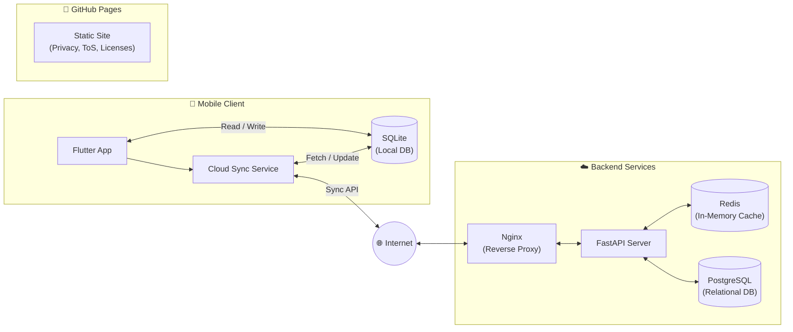
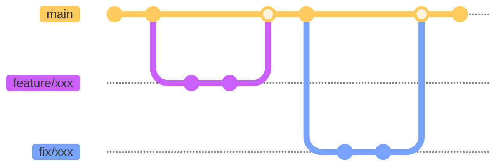

  
  <h1>Leechai</h1>

   

[Download on the App Store](https://apps.apple.com/us/app/id6761012779)

## 🔍 Overview

### Architecture

### Branches

### Tech Stack

- Mobile App
  - Programming Language: Dart
  - Framework: Flutter
- API Server
  - Programming Language: Python
  - Framework: FastAPI
- Database: PostgreSQL
- Reverse Proxy: Nginx

## 🧑🏻‍💻 Development

### Quick Start

1. **Backend:** Follow [apiserver/README.md](apiserver/README.md).
2. **Mobile:** Follow [mobile/README.md](mobile/README.md).

### Development Workflow

1. Create a branch from `main` (`feature/xxx` or `fix/xxx`).
2. Commit and push, then open a PR on GitHub.
3. After approval, merge into `main`.
