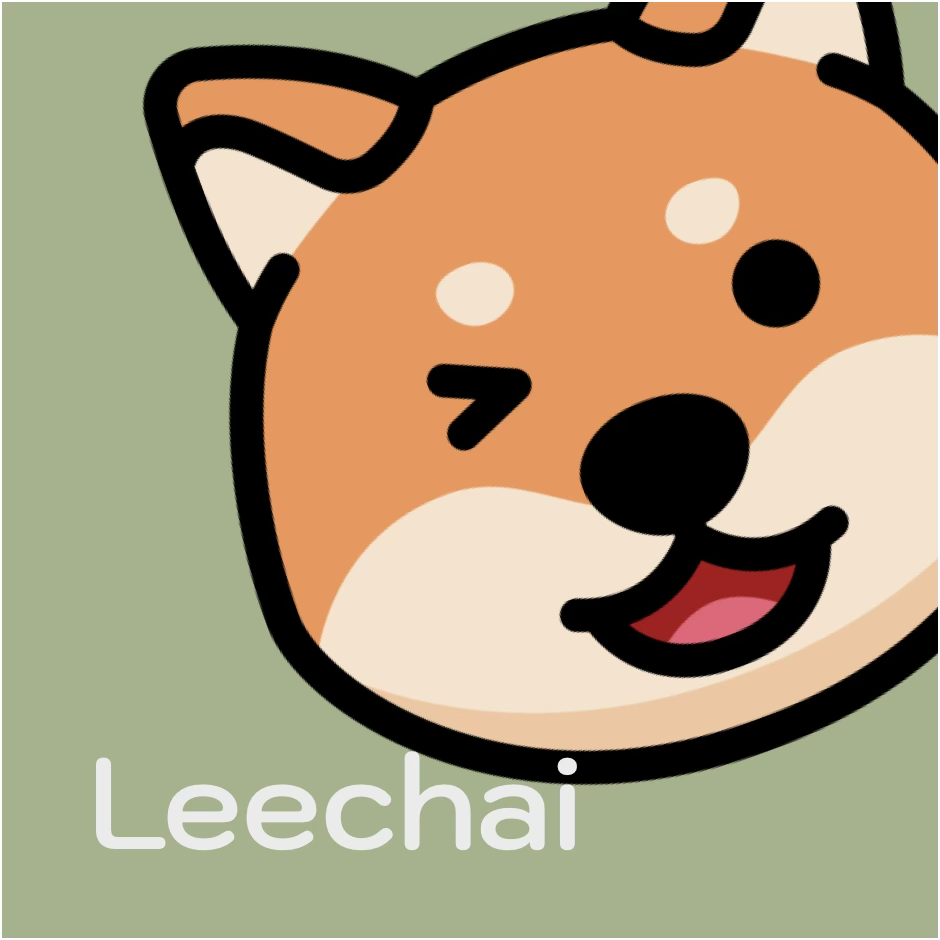
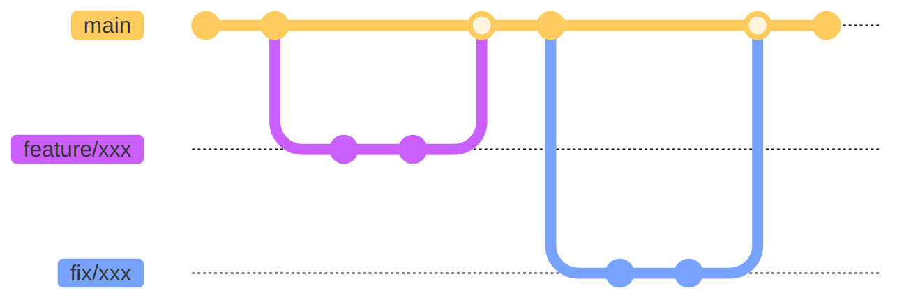

<div align="center">
  
  <h1>Leechai</h1>
</div>

   

## 🔍 Overview

### Architecture

```mermaid
architecture-beta
    group clients(cloud)[Mobile Clients]
    service app(app)[Mobile App] in clients
    group localhost(server)[Localhost]
    service db(database)[Relational Database] in localhost
    service in_mem_cache(database)[In Memory Cache] in localhost
    service api_server(server)[API Server] in localhost
    service reverse_proxy(server)[Reverse Proxy] in localhost
    service internet(internet)[Internet]

    app{group}:B --> T:internet
    internet:B --> T:reverse_proxy
    reverse_proxy:R --> L:api_server
    api_server:R --> L:db
    api_server:B --> L:in_mem_cache
```



### Branches



### Tech Stack

- Mobile App
  - Programming Language: Dart
  - Framework: Flutter
- API Server
  - Programming Language: Python
  - Framework: FastAPI
- Database: PostgreSQL
- Cache: Redis
- Reverse Proxy: Nginx

## 🧑🏻‍💻 Development

### Prerequisites

#### Backend (API Server)

- Operating System: MacOS or Linux
- Git (>=2.34.0)
- GNU Make (>=3.81.0)
- Docker (>=27.4.0)
- Visual Studio Code (or any other editor that supports devcontainer)

#### Frontend (Mobile App)

- Flutter SDK (>=3.11.0)
- Android Studio (for Android development)
- Xcode (for iOS development, macOS only)
- CocoaPods (for iOS dependencies)

### Quick Start

- Step 0: Clone the repository

  ```bash
  git clone git@github.com:bingyangchen/leechai.git
  cd leechai
  ```

#### Backend (API Server)

- Step 1: Create .env file

  ```bash
  cp example.env .env
  ```

  Fill in the values for the environment variables.

- Step 2: Build the images for development

  ```bash
  make build-dev
  ```

- Step 3: Install Git hooks

  ```bash
  make install-git-hooks
  ```

  This command will add some essential scripts into the .git/hooks/ directory.

- Step 4: Generate SSL certificates and keys for development

  ```bash
  make cert-dev
  ```

- Step 5: Run the Development Server

  ```bash
  make start
  # To stop the server, run `make stop`
  ```

#### Frontend (Mobile App)

Ensure the backend server is running locally before starting the app.

- Step 1: Navigate to the `mobile` directory

  ```bash
  cd mobile
  ```

- Step 2: Install dependencies

  ```bash
  flutter pub get
  ```

- Step 3: Run the app

  ```bash
  flutter run
  ```

### The Development Workflow

- **Step 1:** Create a branch from `main`, naming it `feature/xxx` or `fix/xxx`.
- **Step 2:** Complete your work, then commit and push your changes.
- **Step 3:** Open a pull request on GitHub and obtain approval for your PR.
- **Step 4:** Merge your branch into `main`.

### Dependency Management

Let's dive deeper into the details of **Step 2** of the development workflow when you need to add or remove a dependency:

#### Backend (API Server)

- **Step 2-1:** Enter the shell of the API server container.
- **Step 2-2:** Install/Remove the dependency: `uv add {DEPENDENCY} --no-sync` or `uv remove {DEPENDENCY} --no-sync`
  - Note: The `--no-sync` flag prevents the download of the dependency, only version check will be performed.
- **Step 2-3:** Exit the shell and rebuild the images for development.
- **Step 2-4:** Restart the API server container.

#### Frontend (Mobile App)

- **Step 2-1:** Navigate to the `mobile` directory.
- **Step 2-2:** Add the dependency: `flutter pub add {DEPENDENCY}` or remove it: `flutter pub remove {DEPENDENCY}`.
- **Step 2-3:** If it's an iOS-specific dependency, navigate to `mobile/ios` and run `pod install`.

### Environment Variable Management

- **Step 1:** Define a new environment variable (with no value) in the `example.env` file.
- **Step 2:** Define the environment variable (with the value) in the `.env` file.
- **Step 3:** If it is used in the API server, you will also need to define the environment variable in `api-server/main/env.py` and `.github/workflows/lint-and-test.yaml`.

  You will also need to add the new environment variables into the `Test` environment on GitHub repository settings (Settings > Environments > Test > Variables/Secrets).
