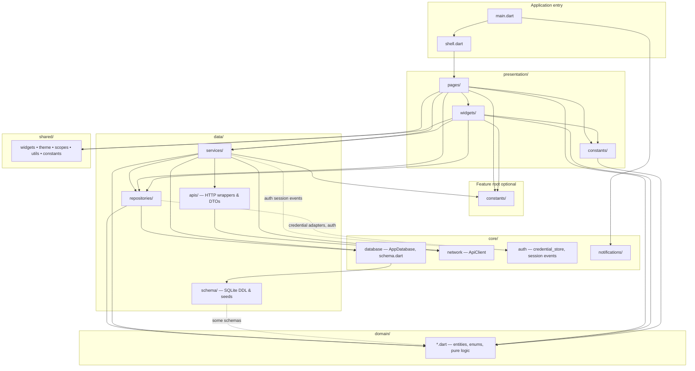

# Mobile App

## Prerequisites

- Flutter SDK (>=3.11.0)
- Android Studio (for Android development)
- Xcode (for iOS development, macOS only)
- CocoaPods (for iOS dependencies)

## Layered Architecture

Code under **`lib/`** matches the diagram: each **`features/<area>/`** has **`presentation/`**, **`domain/`**, **`data/`**, and optionally **`constants/`** beside those folders; **`core/`** owns **`AppDatabase`**, which runs each feature’s **`schema/`** migrations; **`shared/`** is reused widgets and theme.



## Quick Start

Ensure that the API server is running locally first.

1. From project root, go to mobile:

   ```bash
   cd mobile
   ```

2. Install dependencies:

   ```bash
   flutter pub get
   ```

3. Run the app:

   ```bash
   flutter run
   ```

## How to Manage Dependencies

- **Step 1**: From the `mobile` directory: `flutter pub add {DEPENDENCY}` or `flutter pub remove {DEPENDENCY}`.
- **Step 2**: For iOS-only dependencies: go to `mobile/ios` and run `pod install`.

## Launcher App Name (SSOT)

Desktop / home-screen display name is defined only in `pubspec.yaml` under `names_launcher`.

Do not hand-edit `Info.plist`, `*.lproj/InfoPlist.strings`, or Android `strings.xml` for the app name. After changing the config, regenerate:

```bash
cd mobile
dart run names_launcher:change
```

iOS includes `zh-Hant` in `names_launcher` so the binary ships `zh-Hant.lproj` (App Store product-page Languages can list Traditional Chinese). If you add another locale, also add that `.lproj` / `values-*` resource to the Xcode / Android project if the tool does not wire it automatically.

## 🚀 Release

### Build for iOS

0. Remember to update `version` in `pubspec.yaml`.

1. From project root, go to `mobile`:

   ```bash
   cd mobile
   ```

2. Install dependencies:

   ```bash
   flutter clean
   flutter pub get
   ```

3. Build iOS archive and export `.ipa`:

   ```bash
   flutter build ipa --release
   ```

4. Open Transporter (Mac App Store app), then drag the generated `.ipa` file into Transporter:

   ```text
   build/ios/ipa/*.ipa
   ```
